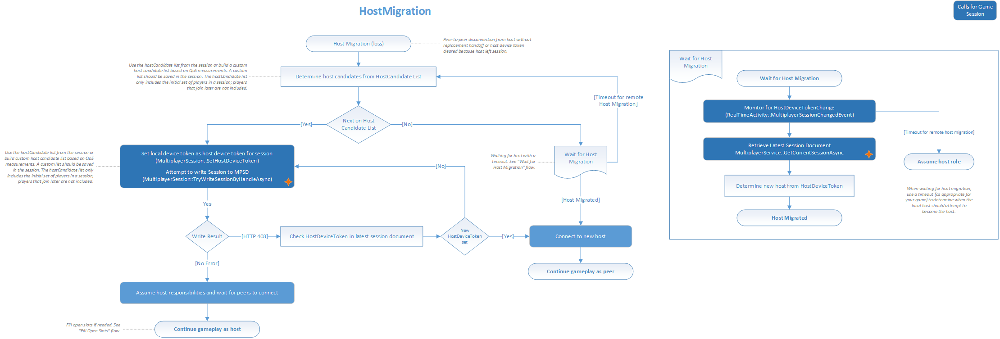

# Migrating an arbiter

At some point during a 2015 Multiplayer session, you might need to select a new arbiter, using arbiter migration.

There are two types of migration:
-   **Graceful arbiter migration**
-   **Failover arbiter migration**

The following flow chart illustrates how to migrate an arbiter.

## Graceful Arbiter Migration

In graceful arbiter migration, the outgoing arbiter can assist with the migration task and determine a new arbiter.
This type of migration uses the setting of an arbiter as described in the section [Set an arbiter for an MPSD session](../mpsd/how-to/live-mpsd-how-tos.md#set-an-arbiter-for-an-mpsd-session) in the article "Multiplayer tasks".

## Failover Arbiter Migration

In a failover arbiter migration, connection to the previous arbiter is lost and the remaining peers must determine a new arbiter for the session.
Failover arbiter migration also sets the host device token, and handles HTTP/412 status codes just as graceful arbiter migration does.
However, there are multiple approaches for selecting a new arbiter during a failover arbiter migration.

## Select Arbiter Using the Host Candidate List

You can configure MPSD to provide an ordered host candidate list based on matchmaking QoS metrics that are measured during certain operations.
The client can use this list to determine a new arbiter.

To take advantage of this list during arbiter migration, each peer can:
1.  Identify the list position of the previous arbiter.
2.  Evaluate the next console in the list.
3.  If the console is the local console, use it as new the arbiter.
4.  If the console is no longer present in the multiplayer session, or has disconnected from its peers, move on to the next candidate in the list and evaluate it as in the previous steps.
5.  If reaching the end of the list with no new arbiter selected, use a greedy approach to arbiter selection, which can break connectivity. See "Use Greedy Arbiter Selection."

| Note                                                                                                                                                                                                                                                                                    |
|------------------------------------------------------------------------------------------------------------------------------------------------------------------------------------------------------------------------------------------------------------------------------------------------------|
| It is not recommended to create a host candidate list in-game after matchmaking through explicit in-title QoS probes. If this mechanism is absolutely necessary, have your client use the host device token instead of user information, for example, Xbox user ID, to determine arbiter candidates. |

### Select Arbiter Using Peer Voting

If full connectivity exists among all peers, they can use peer messages to vote and select a new arbiter.
The new arbiter then updates the host device token for the session using a synchronized update.

See the section [Update an MPSD session](../mpsd/how-to/live-mpsd-how-tos.md#update-an-mpsd-session) in the article "Multiplayer tasks".

### Use Greedy Arbiter Selection

Sometimes no host candidate list is available or connectivity QoS is not needed, for example, for pure arbiter responsibilities.
In these cases, your client can use a greedy arbiter selection approach.

In that case, a peer should set the new arbiter as soon as it detects that the original arbiter has left the game session, as reported by the **MultiplayerSessionChanged** event.
All other peers see an HTTP/412 status code when trying to set the host device token, assuming no other changes to the session are made at this point.

Only one peer succeeds in selecting the new arbiter.

## See also

[Multiplayer Session advanced topics](../mpsd/concepts/live-mpsd-details.md)
