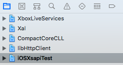
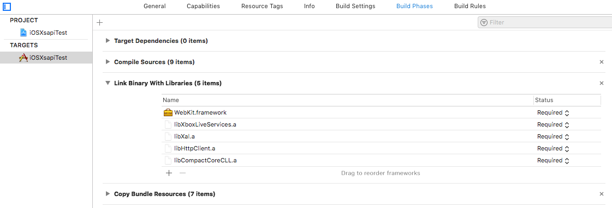
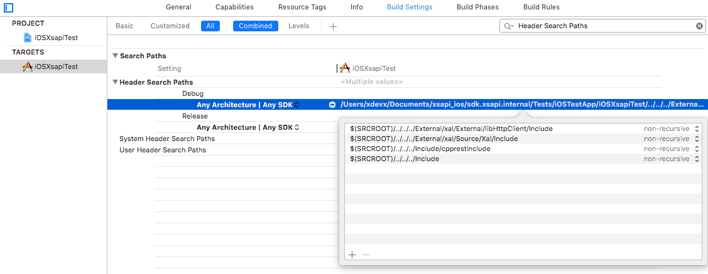
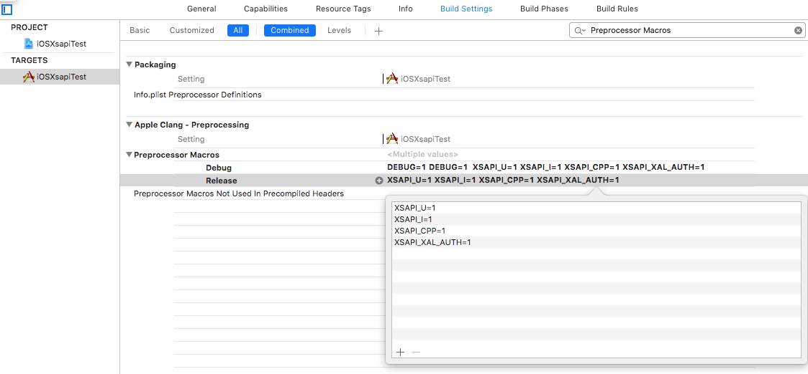

# Get started with Xbox Live APIs on iOS

In order to use the Xbox Live APIs with an iOS game, you must link the Xbox Live API source in your project and build it.

## Add the Xbox Live API projects to your workspace

1. Add the following Xcode projects to your workspace:  

    * `Build\Microsoft.Xbox.Services.iOS\XboxLiveServices.xcodeproj`
    * `External\xal\Source\Xal\Xal.xcodeproj`
    * `External\xal\External\CompactCoreCLL\CompactCoreCLL.xcodeproj`
    * `External\xal\External\libHttpClient\Build\libHttpClient.Apple.C\libHttpClient.xcodeproj`

    

2. Link to the project binaries by navigating to your project's build phases, then clicking the add button under **Link Binary With Libraries**.

    

3. Add the following header paths by navigating to your project's build settings, then selecting the **Header Search Paths** field:

    * `{xbox live api path}/Include`
    * `{xbox live api path}/Include/cpprestinclude`
    * `{xbox live api path}/External/xal/Source/Xal/Include`
    * `{xbox live api path}/External/xal/External/libHttpClient/Include`

    

4. Add the following preprocessor macros by navigating to your project's build settings, then selecting the **Preprocessor Macros** field:

    * `XSAPI_U=1`
    * `XSAPI_I=1`
    * `XSAPI_CPP=1`
    * `XSAPI_XAL_AUTH=1`

    

5. Navigate to the **Keychain Sharing** section of your project's **Capabilities**, then add the following keychain group to the list:

    * `com.microsoft.xal`

    

## Samples

Included in the SDK download are iOS samples, under `{Xbox Live API root}\InProgressSamples\ID@XboxSDK`.

## Remarks about using the Xbox Live APIs on iOS

### Sign-in and authorization

iOS games that use the Xbox Live APIs use the Xbox Authentication Library (XAL) in order to associate players with their Xbox Live identity.

After signing a player in with XAL, your game should then create an `xbox_live_context` and pass the XAL user handle as a parameter.
After that, the `xbox_live_context` should look and function the same as it does on any other platform.

For more information about signing in a player by using XAL in an iOS game, see [Xbox Live Authentication Layer (Xal) with iOS](../../../../../using-xbox-live/auth/iOS-xal.md).

### xboxservices.config

The Xbox Live APIs for iOS rely on [xboxservices.config](../../../../../xboxservices-config.md).
On iOS, you can just add the config file to your project.

### Async library

The async library for iOS only supports `AsyncQueueDispatchMode::AsyncQueueDispatchMode_Manual`.
This means your title has to create an async queue and pump the work and completion threads.  

You can find a cross-platform solution at `{Xbox Live API Root}\InProgressSamples\Kits\XboxLiveToolkit\mobile\AsyncIntegration`.  
`AsyncIntegration` handles pumping the background thread and allows the title to control the completion thread by calling `DrainAsyncCompletionQueueUntilEmpty` when ready.
