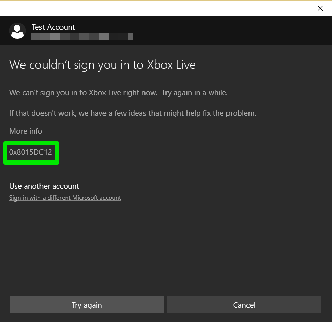
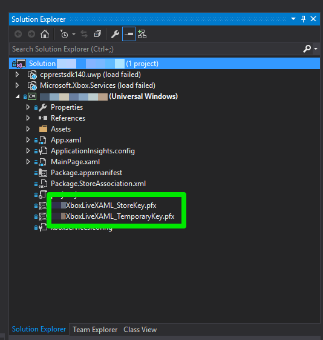
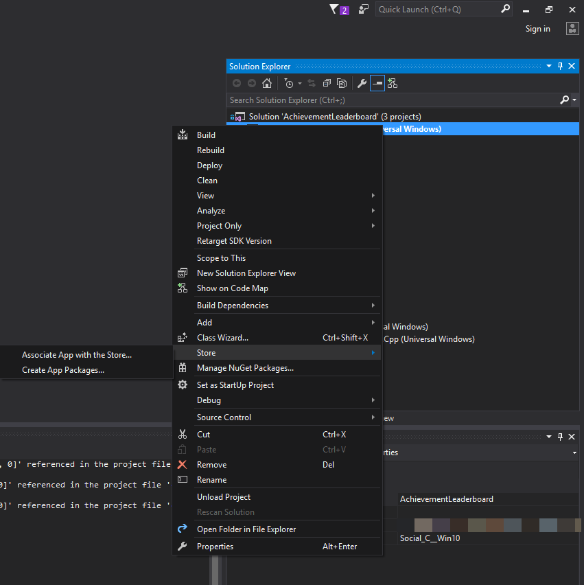

# Troubleshooting Xbox Live sign-in

There are several issues that can cause difficulty signing-in.
To minimize the chance of unexpected errors, do the steps in [Get started with Visual Studio for UWP games](../../get-started/setup-ide/managed-partners/vs-win10/get-started-with-visual-studio-and-uwp.md).

## Common Issues

### Sandbox Problems

Generally speaking, you should familiarize yourself with the concept of Sandboxes and how they pertain to Xbox Live.
You can see more information in the [Xbox Live Sandboxes](../../xbox-live-sandboxes.md) guide.

Briefly, sandboxes enforce content isolation and access control before retail release.
Users without access to your development sandbox cannot perform any read or write operations that pertain to your title.
You can also publish variations of service config to different sandboxes for testing.

Some things to watch out for with regards to sandboxes are discussed below.

#### Developer account doesn't have access to the right sandbox for run-time access

To sign-in to a title that is in development, a test account (also known as a *development account*) or an authorized developer account must be used.
Make sure you are attempting to sign-in with one or the other.

Test accounts are created at Partner Center.
You can authorize an Xbox Live-associated developer account on Partner Center at [https://partner.microsoft.com/en-us/xboxconfig/TestAccounts/Creator](https://partner.microsoft.com/en-us/xboxconfig/TestAccounts/Creator).

Ensure that the account has access to the sandbox your title is published to.
The test accounts you create in Partner Center inherit the permissions of the Partner Center account that created them.

#### Your device is not on the correct sandbox

The device you are developing on must be set to a development sandbox.
On Xbox One, you can set your sandbox using *Xbox One Manager*.

For Windows 10 Desktop, you can use the `SwitchSandbox.cmd` script that's located in the `Tools` directory of the Xbox Live SDK installation.

#### Your title's service configuration is not published to the correct development sandbox

Ensure your title's service configuration is published in a development sandbox.
You cannot sign-in to Xbox Live in a given development sandbox for a title, unless that title is published to the same sandbox.

To publish the title to the same sandbox, see [Partner Center Documentation](../../xbox-live-service-configuration.md#sandbox-ids).

To publish your Partner Center configuration, see Partner Center Documentation: [Xbox Live service configuration for the Creators Program: Publish your Xbox Live service configuration](../../get-started-with-creators/xbox-live-service-configuration-creators.md#publish-your-xbox-live-service-configuration).

### IDs configured incorrectly

There are several pieces of ID required to configure your game.
You can see more information in [Get started with Visual Studio for UWP games](../../get-started/setup-ide/managed-partners/vs-win10/get-started-with-visual-studio-and-uwp.md) or [Getting started with cross-play games](../../get-started-with-partner/get-started-with-cross-play-games.md), depending on what type of title you are creating.

Some things to watch out for are:
* Ensure your App ID is entered into Partner Center correctly.
* Ensure your PFN is entered into Partner Center correctly.
* Double-check you have created an xboxservices.config in the same directory as your Visual Studio project as described in the [Adding Xbox Live to a new or existing UWP project](../../get-started/setup-ide/managed-partners/vs-win10/get-started-with-visual-studio-and-uwp.md) guide.
* Ensure that the "Package Identity" in your appxmanifest is correct. This is shown in Partner Center as "Package/Identity/Name" in the App Identity section.

### Title ID or SCID not configured correctly

For UWP titles, your title ID and SCID must be set to the correct value in your xboxservices.config file.
Also ensure that this file is properly formatted as UTF8. You can see more information in [Get started with Visual Studio for UWP games](../../get-started/setup-ide/managed-partners/vs-win10/get-started-with-visual-studio-and-uwp.md).
The xboxservices.config file is case-sensitive.

For XDK titles, these values are set in your `package.appxmanifest`.

You can see examples for both UWP and XDK title configuration in the `Samples` directory of the Xbox Live SDK.

## Test using the Xbox App

If you are developing a UWP application, you can debug some issues using the Xbox App:
1. Set your device's sandbox to a development sandbox using the `SwitchSandbox.cmd` script.
2. Open the Xbox App, and attempt to sign-in using a test account with access to the same sandbox.

If you are able to successfully sign-in, this confirms that your development sandbox has been set correctly on your device, and your test account has access to it.

If you are still getting sign-in errors, it is likely that your service configuration is not published to your sandbox, or your `xboxservices.config` is not set up properly.
The `xboxservices.config` file is case-sensitive.

## Debug based on error code

Following are some of the error codes you may see upon sign-in, and steps you can take to debug these errors.
The error codes appear as follows:

### 0x80860003 The application is either disabled or incorrectly configured

1. Try deleting your PFX file.

   

   If you didn’t sign-in to Visual Studio with the Microsoft Account used for provisioning the app in Partner Center, Visual Studio will auto generate a signing pfx file based on your personal Microsoft Account or your domain account.
   When building the appx package, Visual Studio will use that auto-generated pfx to sign the package & alter the “publisher” part of the package identity in the `package.appxmanifest`.
   As a result, the produced bits (specifically, the `appxmanifest.xml`) will have a different package identity than what you intend to use.

2. Double-check that your `package.appxmanifest` is set to the same application identity as your title in Partner Center.
   You can either right-click on your project and choose **Store** -> **Associate App With Store...**, as shown in the below screenshot; or, manually edit your `package.appxmanifest`.
   For more information, see [Get started with Visual Studio for UWP games](../../get-started/setup-ide/managed-partners/vs-win10/get-started-with-visual-studio-and-uwp.md).

   

### 0x8015DC12 Content Isolation Error

This error means that either the device or user doesn't have access to the specified title.

1. This could mean you're not using a test account to attempt sign-in, or your test account doesn't have access to the same sandbox you're signed in as.
   Please double-check the instructions on creating test accounts in the [Partner Center documentation.](../../xbox-live-test-accounts.md).
   If necessary, create a new test account with access to the appropriate sandbox.

   You may need to remove your old account from Windows 10, you can do that by going to Settings from the Start Menu, and then going to Accounts.

2. Double-check that your title is published to the sandbox that you are trying to use.
   See [Partner Center Documentation](../../xbox-live-service-configuration.md#sandbox-ids).

### 0x87DD0005 Unexpected or unknown title

Double-check the Application ID Setup and Partner Center Binding in Partner Center.

You can view the instructions in the section [Associate your app with the Microsoft Store](https://docs.microsoft.com/en-us/windows-hardware/drivers/devapps/step-1--create-a-uwp-device-app#associate-your-app-with-the-microsoft-store) in the article "Adding Xbox Live Support to a new or existing Visual Studio UWP".

### 0x87DD000E Title not authorized

Double-check that your device is set to the proper development sandbox and that the user has access to the sandbox.
To verify these with the Xbox App, see [Test using the Xbox App](#test-using-the-xbox-app) above.

If that doesn't resolve the issue, then also check the Partner Center Binding and App ID setup as described above.

If you are getting an error not described here, see the error list in the `xbox::services::xbox_live_error_code` documentation, to get more information about the error codes.
You can also refer to `errors.h` in the XSAPI includes.

After all these steps, if you still cannot sign-in with your title, post a support thread on the [forums](https://forums.xboxlive.com), or (for ID@xbox or Managed Partners) reach out to your Developer Account Manager (DAM).
