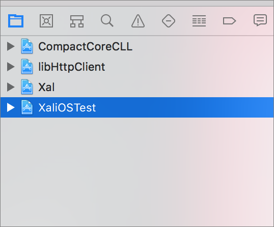
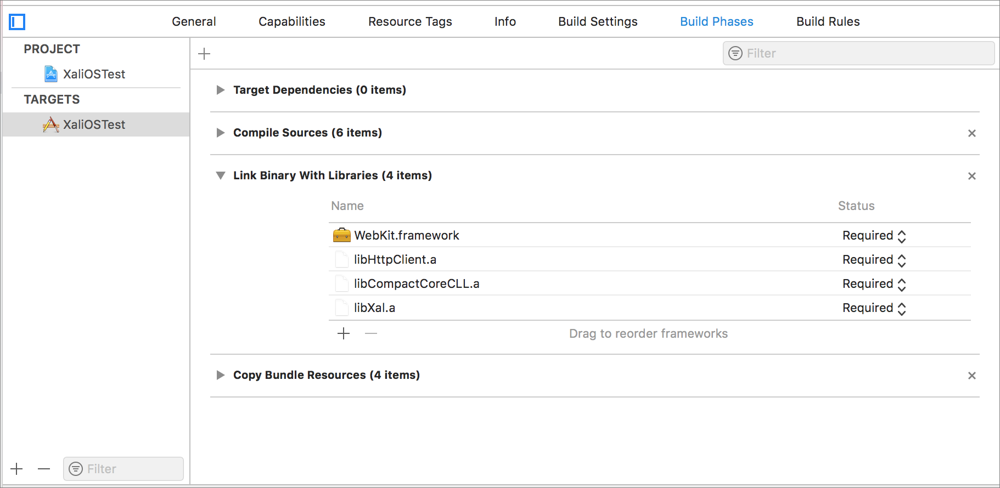
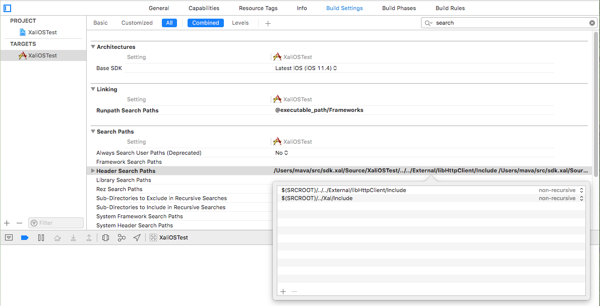
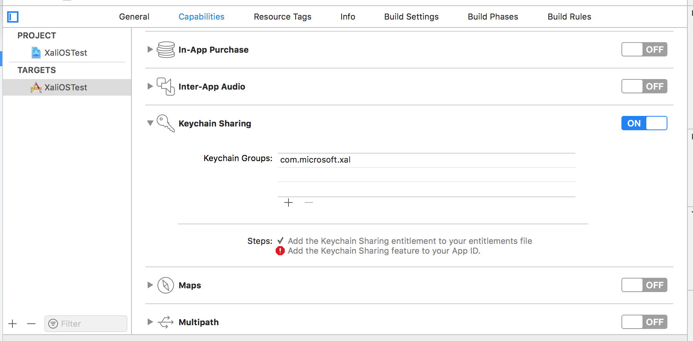

# XAL on iOS

Once you have acquired the XAL source code you will need to set up your iOS development environment. IOS work can only be done on a Mac in the Xcode development environment.  

## Requirements

- Macintosh Computer
- Xcode 9 or later, we recommend the latest version.  

## Setup

In your Xcode environment you will want to open Xal.xcworkspace.  

In order to use XAL in your iOS project you will need to include the following projects:

```
- \External\CompactCoreCLL\CompactCoreCLL.xcodeproj
- \External\libHttpClient\Build\libHttpClient.Apple.C\libHttpClient.xcodeproj
- \Source\Xal\Xal.xcodeproj
```

You may drag them into the **Project Navigator** of your iOS project.  



You will need to make sure to link with the resulting binaries in the **Build Phases** settings of your project.  

- libHttpClient.a
- libCompactCoreCLL.a
- libXal.a  



Navigate to **Build Settings** and add the following paths to your **Header Search Paths** setting:

```
- ../Source/Xal/Source/Include
- ../External/libHttpClient/Include
```



Finally navigate to the **Keychain Sharing** section of your project **Capabilities**
and add "com.microsoft.xal" to the list.  



At this point you can build the iOS sample app as well as integrate XAL code into you iOS project.